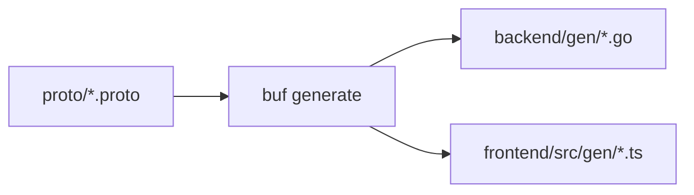

Zera adopts a monorepo architecture, unifying the management of frontend, backend, and proto definitions.

## Directory Structure

```
zera/
├── proto/              # Protocol Buffers definitions
│   ├── buf.yaml        # Buf configuration file
│   ├── base/           # Base proto definitions
│   └── greet/          # Business proto definitions
│       └── v1/
│
├── backend/            # Go backend service
│   ├── buf.gen.yaml    # Backend code generation configuration
│   ├── config.toml     # Service configuration file
│   ├── go.mod          # Go module definition
│   ├── cmd/            # Entry programs
│   │   └── server/
│   │       └── main.go
│   ├── gen/            # Generated Go code
│   └── internal/       # Internal packages
│       ├── config/     # Configuration management
│       ├── handler/    # RPC handlers
│       ├── middleware/ # Middleware
│       ├── model/      # Data models
│       ├── repository/ # Data access layer
│       ├── server/     # Server setup
│       └── service/    # Business logic
│
├── frontend/           # React frontend application
│   ├── buf.gen.yaml    # Frontend code generation configuration
│   ├── package.json    # npm dependencies
│   ├── vite.config.ts  # Vite configuration
│   ├── src/
│   │   ├── App.tsx     # Root component
│   │   ├── main.tsx    # Entry file
│   │   ├── config/     # Configuration files
│   │   └── gen/        # Generated TypeScript code
│   └── public/         # Static assets
│
├── docs/               # Documentation site (Fumadocs)
│   ├── app/            # Next.js App Router
│   └── content/        # MDX documentation content
│
├── build/              # Build artifacts
├── Docker/             # Docker configuration
│   └── docker-compose.yml
│
├── Taskfile.yml        # Task configuration
├── vercel.json         # Vercel deployment configuration
└── README.md           # Project description
```

## Core Directory Descriptions

### proto/

Contains all Protocol Buffers definition files. Organized by functional modules with versioning support (e.g., `v1`).

```proto
// greet/v1/greet.proto
syntax = "proto3";

package greet.v1;

service GreetService {
  rpc Greet(GreetRequest) returns (GreetResponse);
}
```

### backend/

Go backend service following Clean Architecture design:

- **cmd/**: Program entry point, responsible for starting the service
- **internal/handler/**: RPC handlers, processing requests and responses
- **internal/service/**: Business logic layer
- **internal/repository/**: Data access layer
- **internal/model/**: Domain model definitions
- **gen/**: Go code automatically generated by Buf

### frontend/

React frontend application built with Vite:

- **src/gen/**: TypeScript code automatically generated by Buf
- **src/config/**: Application configuration, including Connect client configuration

## Code Generation Workflow



After modifying proto files, run `task proto` to automatically generate corresponding Go and TypeScript code.