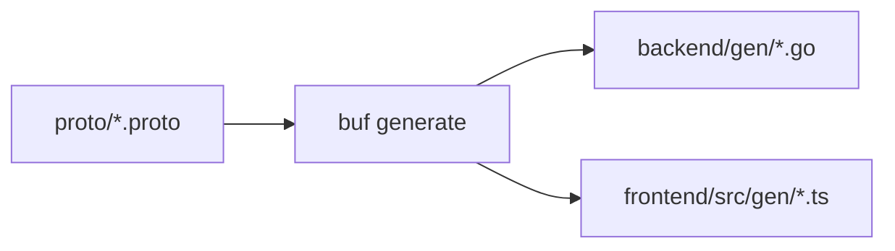

Zera は monorepo アーキテクチャを採用しており、フロントエンド、バックエンド、および proto 定義を一元管理しています。

```
zera/
├── proto/              # Protocol Buffers 定义
│   ├── buf.yaml        # Buf 配置文件
│   ├── base/           # 基础 proto 定义
│   └── greet/          # 业务 proto 定义
│       └── v1/
│
├── backend/            # Go 后端服务
│   ├── buf.gen.yaml    # 后端代码生成配置
│   ├── config.toml     # 服务配置文件
│   ├── go.mod          # Go 模块定义
│   ├── cmd/            # 入口程序
│   │   └── server/
│   │       └── main.go
│   ├── gen/            # 生成的 Go 代码
│   └── internal/       # 内部包
│       ├── config/     # 配置管理
│       ├── handler/    # RPC 处理器
│       ├── middleware/ # 中间件
│       ├── model/      # 数据模型
│       ├── repository/ # 数据访问层
│       ├── server/     # 服务器设置
│       └── service/    # 业务逻辑
│
├── frontend/           # React 前端应用
│   ├── buf.gen.yaml    # 前端代码生成配置
│   ├── package.json    # npm 依赖
│   ├── vite.config.ts  # Vite 配置
│   ├── src/
│   │   ├── App.tsx     # 根组件
│   │   ├── main.tsx    # 入口文件
│   │   ├── config/     # 配置文件
│   │   └── gen/        # 生成的 TypeScript 代码
│   └── public/         # 静态资源
│
├── docs/               # 文档站点 (Fumadocs)
│   ├── app/            # Next.js App Router
│   └── content/        # MDX 文档内容
│
├── build/              # 构建产物
├── Docker/             # Docker 配置
│   └── docker-compose.yml
│
├── Taskfile.yml        # 任务配置
├── vercel.json         # Vercel 部署配置
└── README.md           # 项目说明
```

すべての Protocol Buffers 定義ファイルを格納します。機能モジュールごとに整理し、バージョン管理（例: `v1`）をサポートしています。

```proto
// greet/v1/greet.proto
syntax = "proto3";

package greet.v1;

service GreetService {
  rpc Greet(GreetRequest) returns (GreetResponse);
}
```

Goのバックエンドサービスは、Clean Architectureに従っています：

- **cmd/**: プログラムのエントリポイント。サービスの起動を担当
- **internal/handler/**: RPCハンドラー。リクエストとレスポンスを処理
- **internal/service/**: ビジネスロジック層
- **internal/repository/**: データアクセス層
- **internal/model/**: ドメインモデルの定義
- **gen/**: Bufによって自動生成されたGoコード

ReactのフロントエンドアプリケーションはViteで構築されています：

- **src/gen/**: Bufによって自動生成されたTypeScriptコード
- **src/config/**: アプリケーション設定。Connectクライアントの設定を含む



protoファイルを変更した後は、`task proto` を実行することで対応するGoおよびTypeScriptコードを自動生成できます。